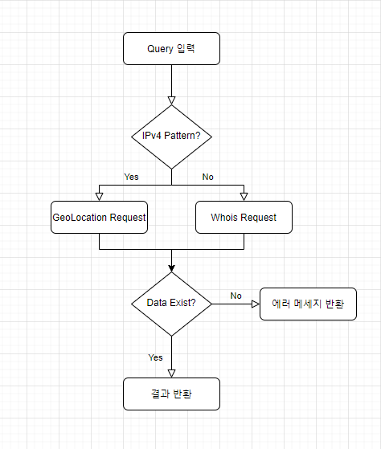
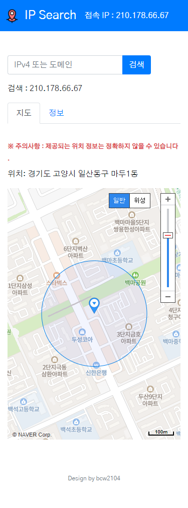
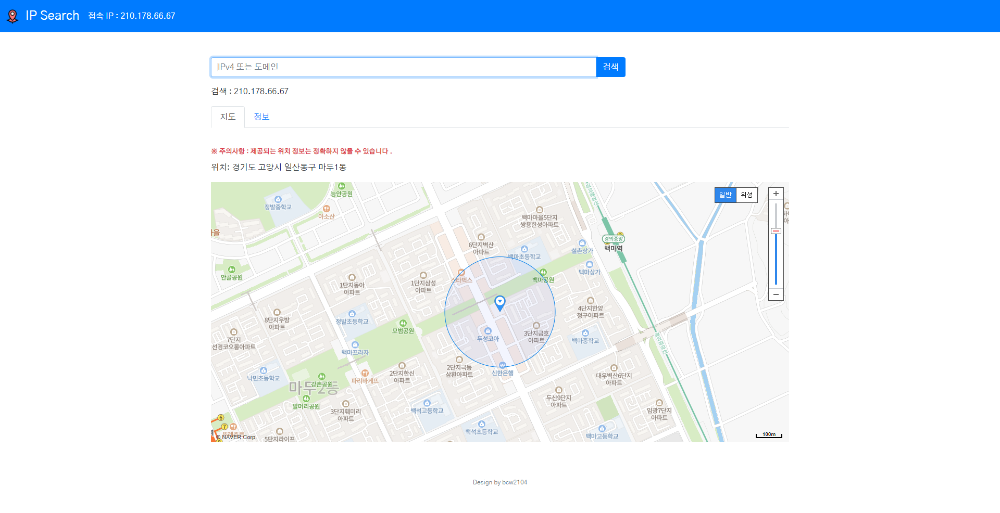

# 🚀 IPSearch

### 📄 개요
IP 정보 및 위치 조회 사이트 구현

 

### 🔗 Link
👉 [IPSearch](https://www.lifencoding.com/ipsearch/)

 

### :hammer: Tech
</a> 
</a> 
</a>
</a> 
</a> 
</a>
</a>

 

### 🛠️ API
- Whois Api
- Naver GeoLocation
- Naver Web Dynamic Map 

 

### 📜 요구 기능
- 사용자(Client)의 IP주소 표시 기능
- IP검색 기능
  * 검색된 IP의 위치 정보 표시 
  * 검색된 IP의 부가 정보 표시
  * 검색된 IP의 위치를 지도에 표시
- Domain검색 기능 (한국 도메인 한정)
  * 검색된 Domain의 위치 정보 표시 
  * 검색된 Domain의 부가 정보 표시
  * 검색된 Domain의 위치를 지도에 표시
- 사용자 요청 빈도 제한
  1. 사이트 첫 진입 시 검색 가능 횟수 초기화 (3번의 검색 가능 횟수 부여)
  2. 검색 후 5초 이내로 재 검색 발생 시 검색 횟수 감소
  3. 검색 가능 횟수가 0인 경우 검색 요청 시 (검색 요청 시간 - 이전 검색 요청 시간)만큼의 대기 시간 발생
  4. 검색 대기 시간 경과 시 검색 가능 횟수 초기화 (1번 과정)

 

### 📌 검색 로직

 

### 📈 개발 순서
- Version 1 -> Naver GeoLocation 관련 서비스 구현 <strong>(완료)</strong>
  * 사용자(Client)의 IP주소 표시 기능
  * 검색된 IP의 정보 표시 
  * UI 구현
- Version 2 -> Naver Web Dynamic Map 관련 서비스 구현 <strong>(완료)</strong>
  * 검색된 IP의 위치를 지도에 표시
  * UI 개선
- Version 3 -> Whois + Geocoding API를 통한 도메인 검색 서비스 구현 <strong>(완료)</strong>
  * 검색된 Domain 관련 정보 표시
  * 검색된 Domain의 위치를 지도에 표시
  * UI 개선
- Version 4 
  * Refactoring

 

### ✈️ 페이지 접속 화면
#### 📱 모바일

#### 💻 PC

